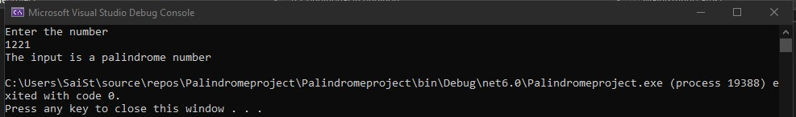

# Palindrome
## Aim:
To write a C# program to find whether the given string is a Palindrome or not.
## Algorithm:
### Step 1:
Create a class and declare a variable with integer datatype
### Step 2:
Use while loop to check whether the input is a palindrome or not.
### Step 3:
Use if condition to check whether input is equal to the calculated number.
### Step 4:
Display the results of the condition of the input using Console.WriteLine().
## Program:
```
using System;
namespace Conditional
{
    public class Ifcondition
    {
        public static void Main(string[] args)
        {
            int num1,temp,n,r,sum;
            Console.WriteLine("Enter the number");
            num1 = Convert.ToInt32(Console.ReadLine());
            temp = num1;
            sum = 0;
            while(num1 > 0)
            {
                r = num1 % 10;
                sum = (sum * 10) + r;
                num1 = num1 / 10;
            }
            if(temp == sum)
            {
                Console.WriteLine("The input is a palindrome number");
            }
            else
            {
                Console.WriteLine("The given number is not a palindrome number");
            }
        }
    }
}

```
## Output:

## Result:
Thus the C# program to display whether the given string is Palindrome or not is executed successfully.
