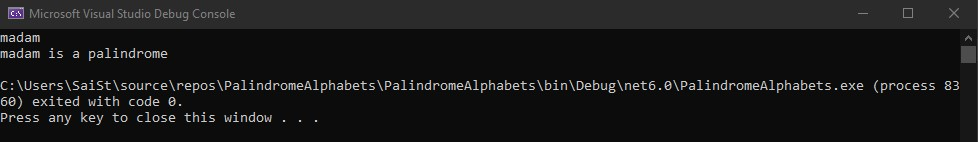
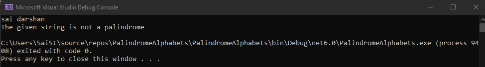

# Palindrome
## Aim:
To write a C# program to find whether the given string is a Palindrome or not.
## Algorithm:
### Step 1:
Create a class and declare a variable with string datatype
### Step 2:
Use for loop to check whether the input is a palindrome or not.
### Step 3:
Use if condition to check whether input is equal to the calculated number.
### Step 4:
Display the results of the condition of the input using Console.WriteLine().
## Program:
```
using System;
namespace Conditional
{
    public class Ifcondition
    {
        public static void Main(string[] args)
        {
            string str,str1="";
            str=Console.ReadLine();
            for(int i=str.Length-1; i>=0; i--)
            {
                str1 += str[i];
            }
            if (str == str1)
            {
                Console.WriteLine("{0} is a palindrome",str);
            }
            else
            {
                Console.WriteLine("The given string is not a palindrome");
            }
        }
    }
}


```
## Output:


## Result:
Thus the C# program to display whether the given string is Palindrome or not is executed successfully.
